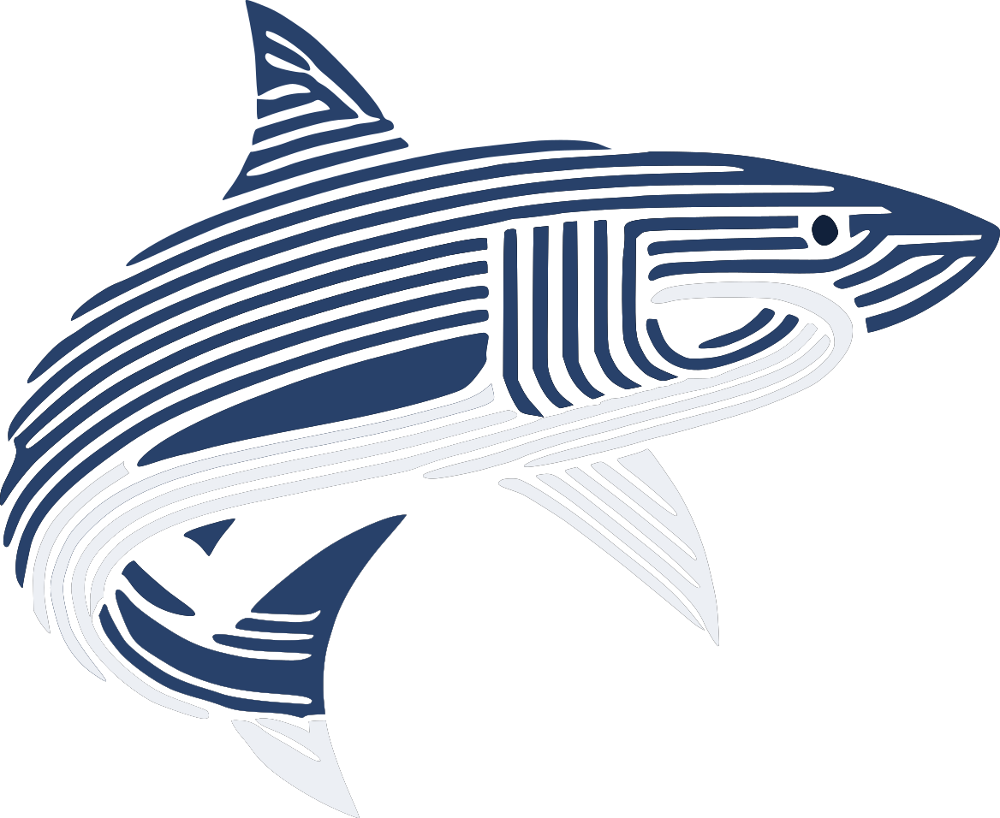
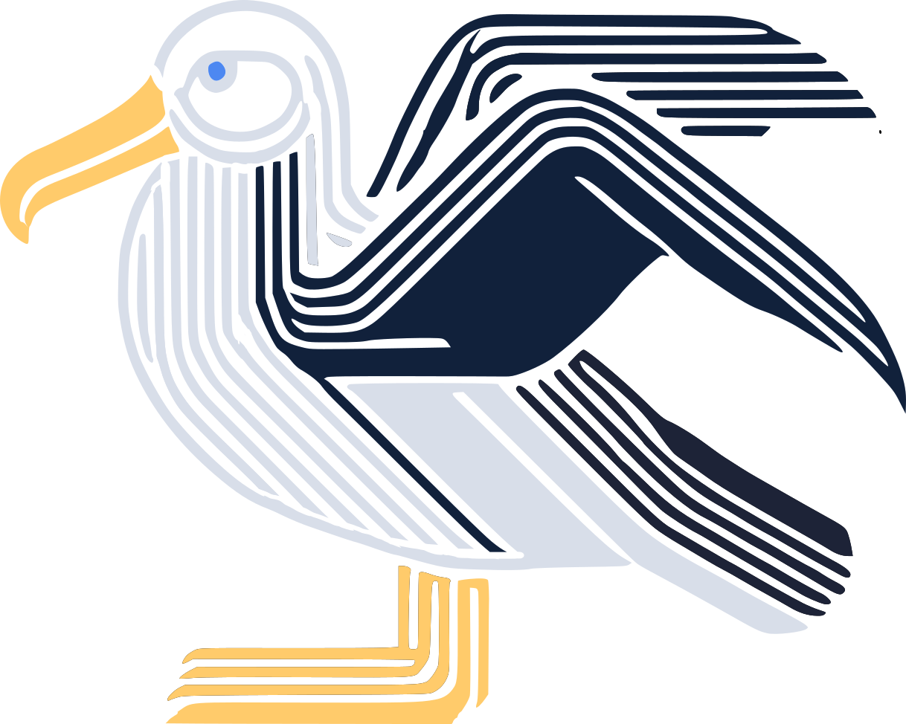
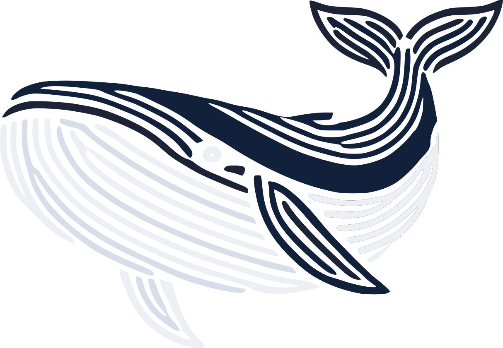
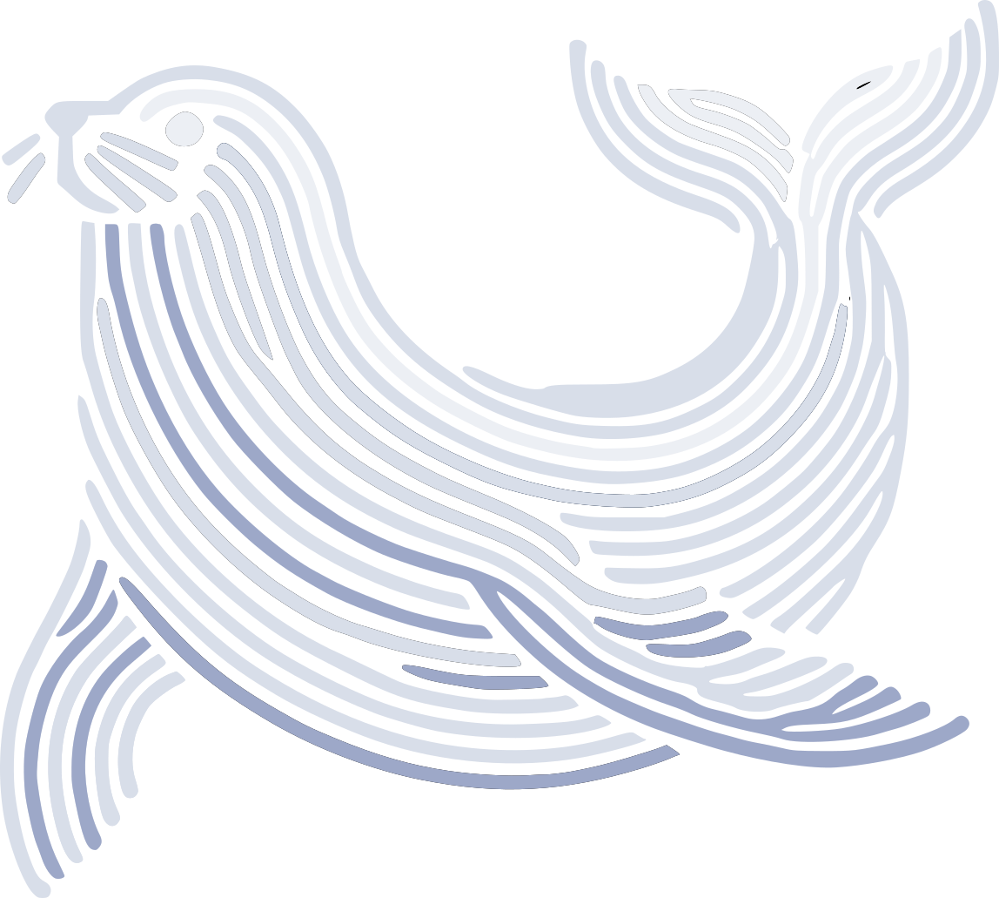
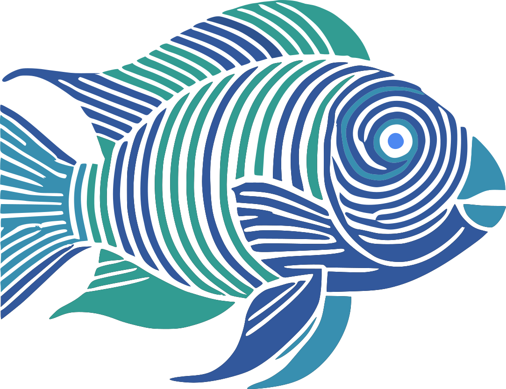
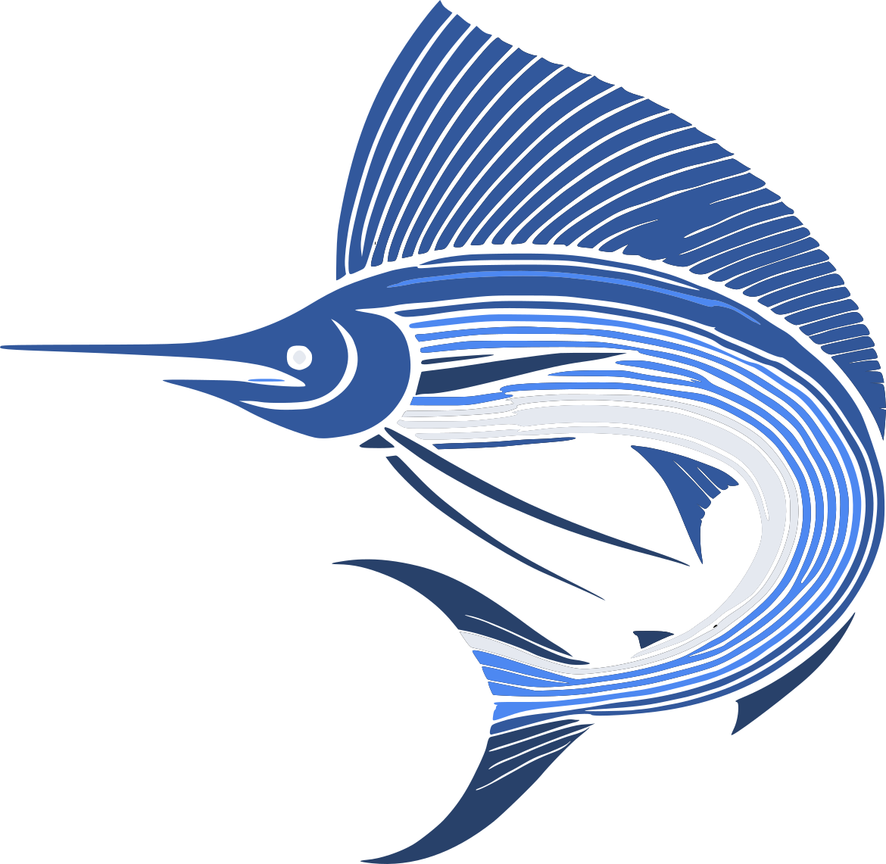
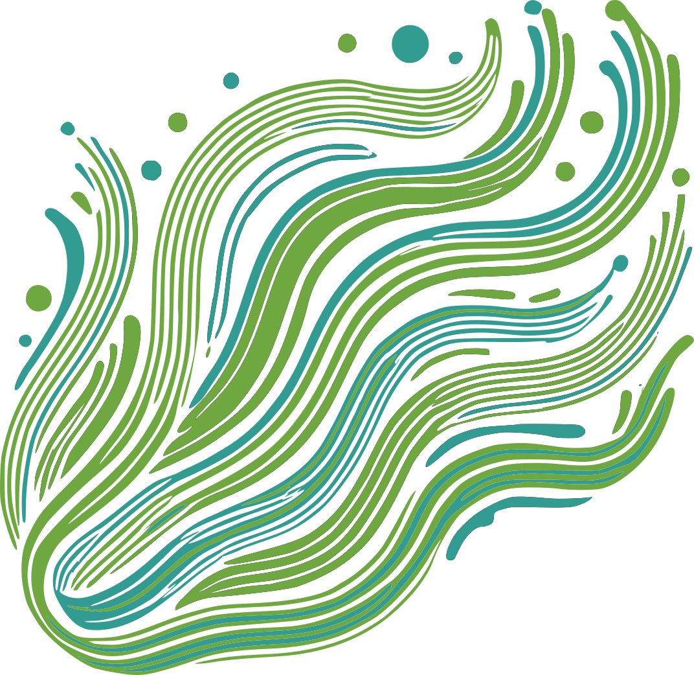
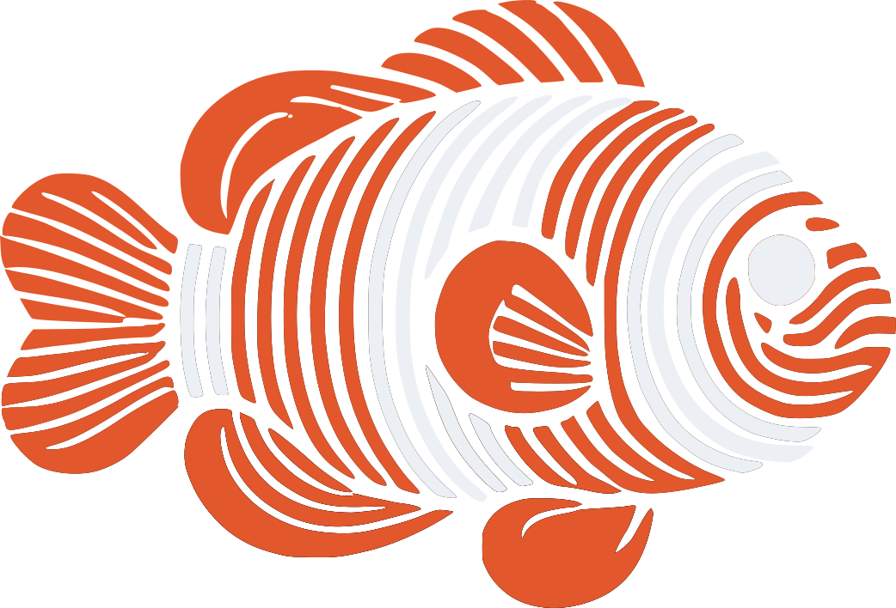
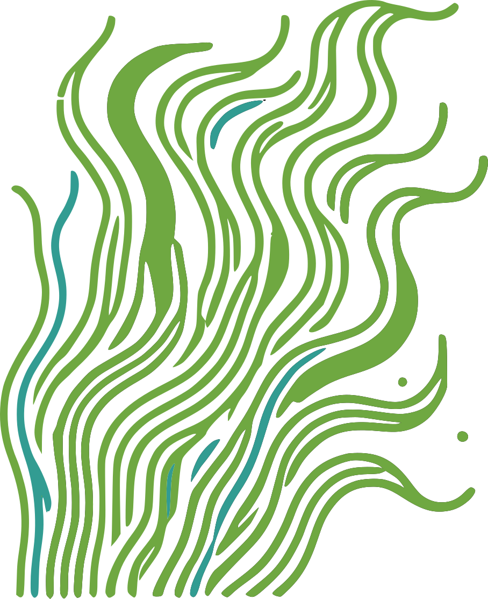

# bab014/pelagic.nvim

## Neovim theme with lots of _blue_ inspired by the [Pelagic Zone](https://en.wikipedia.org/wiki/Pelagic_zone) of the ocean

### Benthic

The dark and deep blues inspired by the wide open and deepest parts of the ocean

Used for backgrounds and more subtle highlighting

### Ice and Foam

From the foam of waves and the floating ice of the arctic, these whites and light greys are directly copied from the [Nord theme](https://github.com/shaunsingh/nord.nvim)

Used as foreground and subtle highlighting

### Endless Blues

Also inspired by the Nord color scheme, these blues are brightened to provide a higher contrast against the deep, benthic blues

### Coral Colors

The vibrancy of the ocean doesn't stop at blue, it is rich with colorful animals and corals which inspired these bright, contrasting colors used to highlight everything

